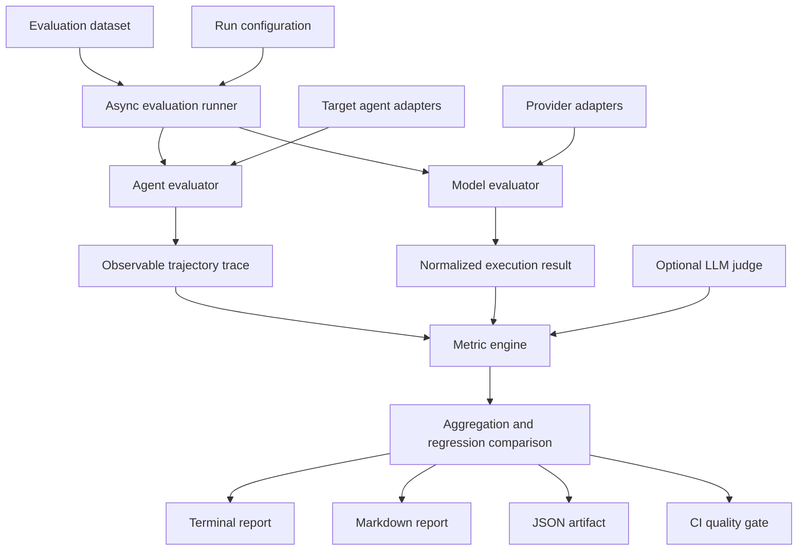

# Agent Evaluation Harness: Design

## 1. Purpose

`agent-eval-harness` is a production-oriented evaluation platform for language models and tool-using agents. Its goal is to make model quality, agent behavior, latency, reliability, and cost observable and comparable before changes reach production.

The project is intended to demonstrate how an AI engineering team can combine deterministic tests, probabilistic evaluation, trajectory analysis, regression baselines, and CI quality gates in one extensible system.

## 2. Goals

The system will:

- evaluate model responses and agent executions as related but distinct workloads;
- record observable execution artifacts without relying on hidden chain-of-thought;
- support deterministic, heuristic, and LLM-as-a-Judge metrics;
- compare candidate runs with stored baselines;
- aggregate quality, latency, token usage, reliability, and estimated cost;
- run locally without paid API credentials through deterministic mock agents;
- provide terminal, Markdown, and JSON reports;
- enforce configurable quality gates in CI;
- expose clear interfaces for adding providers, metrics, datasets, and reporters.

## 3. Non-goals

The first release will not attempt to:

- capture or evaluate private reasoning traces;
- provide a hosted evaluation service or multi-tenant control plane;
- replace full observability platforms;
- claim LLM judges are objective ground truth;
- implement advanced significance testing, experiment tracking, or a web dashboard;
- support every model provider through provider-specific code.

These capabilities may be added later without weakening the core abstractions.

## 4. Design principles

1. **Evaluate observable behavior.** Inputs, outputs, tool calls, arguments, results, errors, retries, timing, usage, and state transitions are valid evidence. Hidden reasoning is not.
2. **Prefer deterministic evidence.** Exact checks and schema validation take precedence when ground truth exists. Judge models are reserved for dimensions that require interpretation.
3. **Separate execution from evaluation.** Providers and target agents produce normalized execution results; metric implementations consume those results independently.
4. **Make failures explicit.** Timeouts, provider errors, parse failures, missing prices, and judge failures remain visible in results instead of silently becoming zero scores.
5. **Design for reproducibility.** Configuration, dataset identity, model metadata, timestamps, and run counts travel with every result artifact.
6. **Keep the local path complete.** The default mock-agent workflow must exercise the real architecture without an API key.

## 5. System architecture

The central contract is a normalized execution result. Model and agent adapters may behave differently, but downstream metrics and reporting should not depend on a specific SDK.

## 6. Model evaluation and agent evaluation

Model evaluation treats one generation as the primary unit of work. It measures answer correctness, structured-output compliance, consistency, latency, token usage, cost, and provider failures.

Agent evaluation includes the final answer plus the path taken to produce it. It measures expected tool selection, argument accuracy, unknown tools, failed calls, repeated actions, step efficiency, groundedness, and goal completion.

Both paths share schemas, execution infrastructure, aggregation, reporting, and regression comparison. Their metrics remain separate where their evidence differs.

## 7. Execution trace design

An agent trace is an ordered list of observable events. Each step has a stable sequence number, event type, timestamp, and typed payload. Initial event types will include:

- model request and response metadata;
- tool call and arguments;
- tool result or tool error;
- retry;
- explicit agent state transition;
- final answer.

Traces will exclude hidden chain-of-thought. Sensitive provider metadata will be filtered before persistence. Deterministic ordering will make results diffable and tests reliable.

## 8. Core contracts

Pydantic models will define datasets, execution results, traces, metric outputs, run summaries, and regression results. Important contracts include:

- `ModelTestCase` and `AgentTestCase`;
- `ToolExpectation`, `ToolCall`, and `ToolResult`;
- `TrajectoryStep`;
- `ModelExecutionResult` and `AgentExecutionResult`;
- `MetricResult` and `TestEvaluationResult`;
- `EvaluationRunResult` and `RegressionResult`.

Schemas will be versionable so stored artifacts can be validated and migrated deliberately.

## 9. Metric model

Metrics return a normalized result containing a name, score where applicable, pass/fail status, explanation, and structured details. The initial metric families are:

- **Deterministic:** exact match, JSON/schema validation, required-field accuracy, tool precision and recall, argument accuracy, and unknown-tool rate.
- **Trajectory:** step efficiency, loop detection, repeated failure detection, tool failure rate, and deterministic goal completion.
- **Operational:** latency, timeouts, token usage, estimated cost, retries, and provider error rate.
- **Judge-based:** faithfulness, open-ended goal completion, relevance, and hallucination detection.

Metric implementations will be small, independently testable classes. Aggregation policy will live outside individual metrics.

## 10. LLM-as-a-Judge

The judge will use the same provider abstraction as model evaluation and require structured output. It will receive only the task, relevant ground truth, observable tool evidence, and final answer.

Reliability controls will include temperature zero, configurable judge models, repeated judge runs, score averaging, explicit parse/error states, and deterministic fallback metrics. Judge scores will always be labeled as probabilistic signals rather than ground truth.

## 11. Runner and concurrency

The runner will use `asyncio` with a bounded semaphore. It will provide configurable concurrency, per-test timeouts, exception isolation, stable result ordering, and repeated runs. A failed case must not terminate the evaluation batch.

Each execution will capture monotonic elapsed time and normalized usage metadata. Provider-specific response data may be retained in a namespaced metadata field when useful for debugging.

## 12. Aggregation and repeatability

Run summaries will calculate pass rate, mean scores, standard deviation across repeated runs, latency percentiles, token totals, and cost totals when available. Missing values will remain missing rather than being treated as zero.

The first version will not claim statistical significance. Interfaces will leave room for bootstrap confidence intervals and hypothesis tests in later releases.

## 13. Baselines and regression gates

Evaluation runs will be saved as versioned JSON artifacts. A comparator will align baseline and candidate cases by test identifier and report aggregate and per-test deltas.

Configurable policies may constrain:

- minimum overall score and pass rate;
- maximum quality regression;
- maximum latency and cost regression;
- maximum hallucination or provider-error rate;
- required deterministic checks.

The CLI will return exit code `0` when the gate passes, `1` for a policy failure, and `2` for configuration or execution errors.

## 14. Provider abstraction and cost

The core package will depend on a `ModelProvider` interface rather than provider SDKs. The initial hosted-model implementation will use LiteLLM, while deterministic tests will use local fakes or mock agents through the same normalized contracts.

Usage records will include input, output, and total tokens. Estimated cost will be recorded when pricing data exists, together with enough model metadata to explain the estimate. Unknown pricing will produce an unavailable value and an explanatory status.

## 15. Reporting and CI

Rich terminal output will optimize for local feedback. Markdown reports will summarize deltas and regressions for pull requests. JSON will preserve the complete machine-readable run.

The default GitHub Actions workflow will install the package, run tests, execute deterministic evaluation, publish report artifacts, and fail when the quality gate is violated. Hosted-model evaluation will remain optional and secret-gated.

## 16. Security and privacy

Datasets and traces may contain sensitive content. The system will avoid logging credentials, support metadata filtering, keep `.env` files out of version control, and document that persisted artifacts require the same data-handling controls as their inputs.

Tool execution will be supplied by the target agent; the harness records and evaluates effects but will not grant tools broader permissions.

## 17. Extension points

Stable interfaces will support new:

- model providers and target-agent adapters;
- dataset loaders and schema versions;
- deterministic, heuristic, and judge metrics;
- aggregation and quality-gate policies;
- reporters and artifact stores;
- pricing sources and trace exporters.

## 18. Delivery plan

Development will proceed in small pull requests:

1. architecture and project documentation;
2. project skeleton, packaging, and container setup;
3. typed schemas and deterministic metrics;
4. trajectory tracing, mock agents, and async agent evaluation;
5. model providers, model evaluation, and LLM judging;
6. aggregation, regression comparison, reporting, and CLI;
7. CI quality gates and final documentation hardening.

Every milestone will include focused tests and an atomic commit history. The good mock agent must pass and the intentionally bad mock agent must perform materially worse before the system is considered complete.

## 19. Key tradeoffs

- **JSON artifacts before a database:** easier local reproducibility and CI portability, at the cost of limited historical querying.
- **LiteLLM as the first hosted adapter:** broad provider coverage with one integration, while preserving an interface that prevents lock-in.
- **Explicit traces instead of framework-specific callbacks:** more adapter work, but consistent evaluation across agent frameworks.
- **Simple thresholds before statistical tests:** understandable CI behavior first, with room for more rigorous inference later.
- **Mock agents in the default path:** reliable and free CI, while hosted evaluation remains an opt-in integration path.

## 20. Definition of success

The initial release succeeds when it installs cleanly, passes unit and integration tests, runs in Docker, differentiates good and bad agent behavior, evaluates model and agent outputs, saves reproducible JSON results, compares baselines, generates human-readable reports, and enforces CI gates without requiring paid credentials.
